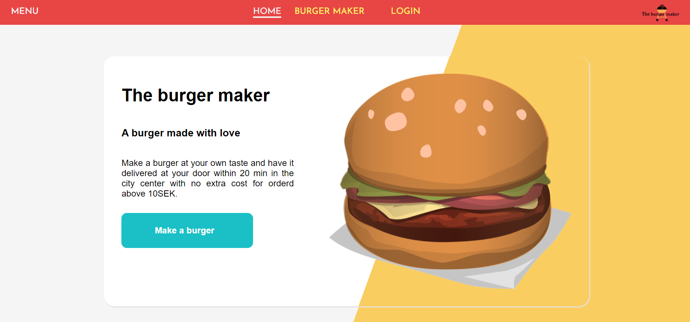

# The burger shop

A burger builder with checkout page and history of orders. The application is built with React, using react hooks, React router for routing, Axios for fetching the data from the database and Firebase for data storage. The project is still in progress.
| |
|:---:|
| Homepage|

## Functionalities

- **add ingredients to a burger**
- **remove ingredients from a burger**
- **the price is dynamically updated according to the number of ingredients added**
- **cancel the order**
- **order the burger**
- **view order history**

## Not fully implemented(future plans):

- **use redux for state management**
- **authenticate the user**

## How to use it

- **Clone the repo: https://github.com/Danijela2019/The-burger-maker.git**
- **Go (cd) to burger-maker folder**
- **Install packages: npm install**
- **Run npm start**
- **Enjoy**
